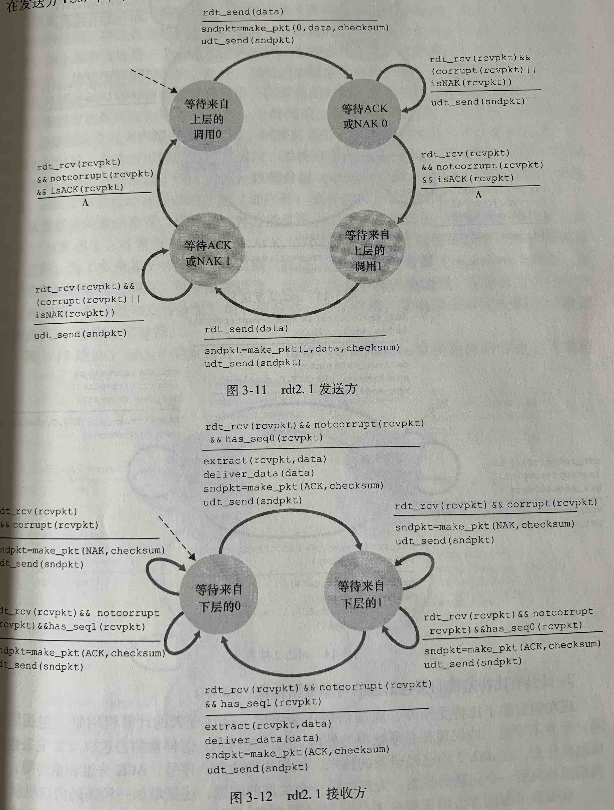

# 第三章 第二周

即使底层信道是不可靠的，TCP 依然提供了可靠的数据传输服务，那么这时如何实现的呢？

## 可靠的数据传输

作者从零开始，为我们展现了实现一个 **可靠数据传输协议（reliable data transfer protocol）** 的过程

### 经可靠信道的传输协议 rdt 1.0

首先我们从最简单的情况开始，即底层的信道是可靠的。这意味着发送方发送的所有分组，都能有序地到达接收方，中间不会有任何丢包。

这种情况下，接收方只需要等待上层应用交付数据，然后再交付给下层信道即可，因为信道保证了数据一定会到达接收方，因此 rdt 1.0 也不需要接收方发送反馈。rdt 1.0 的发送方和接收方的有限状态图(FSM)如下

### 经具有比特差错的信道的可靠数据传输协议 rdt 2.0

这里我们做出一个假设：底层信道传输的分组可能发生比特差错，但是不会丢包。这意味着接收方需要一种方式检测接收到的分组是否出现了错误，以及在出现了错误之后该如何恢复数据

接收方检测差错的办法，在之前的 UDP 章节中也介绍了，就是利用分组的检验和来判断数据的完整性。当接收方收到了数据后，检查检验和，如果数据没有差错，那么就发送 ACK 分组给接收方，接收方就知道了数据正确到达了接收方；如果接收方发现数据出现了错误，那么就发送一个 NAK 分组给接收方，接收方就会重新发送分组，我们把这个可靠传输协议称为 rdt 2.0。

rdt 2.0 的有限状态图如下

在 2.0 中，发送方发送了一个分组后，就等待分组的 ACK/NAK ，因此这是一种 **停等协议(stop-and-wait)**

我们的 rdt 2.0 协议有一个严重的问题，即接收方发送的 ACK 或者 NAK 分组也有可能出现比特错误。有人可能提出一个方法，如果发送方收到一个有差错的 ACK 或者 NAK，那么发送方只需要重新发送分组即可。这个方法也有一个漏洞，即接收方收到一个分组后，不知道这个分组是一个新的分组、还是因为发送方收到有差错的 ACK/NAK 后重新发送的分组。因此我们需要对发送方发送的分组做一个标记，这样我们就得到了 rdt 2.1 协议

在 2.1 协议中，我们在分组中加入了 **序号** 字段，因为这是一个停等歇息，这个字段的长度也就只需要一个比特

书中提到了 rdt 2.1 的升级版 rdt 2.2 ，2.2 取出了 2.1 中接收方反馈的 NAK 分组，使用了带序号的 ACK 分组代替，这样做的好处会在后面才能看见

### 具有比特差错和丢包的信道上的可靠数据传输协议 rdt 3.0

现在我们假设传输信道是不仅会有比特差错，而且还会有丢包。丢包不仅仅是发送方发送的数据分组，有可能接收方反馈的 ACK 分组也会丢包，这两种情况下，发送方都不会受到接收方的 ACK 分组。

一个简单的解决办法是：接收方设置一个定时器，在发送数据分组后启动定时器，在定时器到达后还没受到 ACK 分组，就可以假定数据分组已经丢失了，发送方就重新发送数据分组。定时器的超时时间如何确定呢？如果太短了，那么发送方会重传大量实际没有丢失的分组；如果设置太长了，则发送方不能快速从数据丢失中恢复，也就降低了发送速率。对于接收方来说，它可能会重复收到相同的分组，但是它使用了 rdt 2.2 协议中的带序号的 ACK 分组就能很好的处理这个问题(即发送相同的 ACK 分组)

rdt 3.0 的有限状态图

## 如何提高发送速率

rdt 3.0 已经能够提供在不可靠信道上的可靠数据传输服务了，但是它还有一些缺点，比如发送速率偏低。因为 rdt 3.0 是一个停等协议，在发送方发送了一个数据分组后必须等待接收方的 ACK 反馈。它的发送速率是

>  发送速率 = (数据分组大小) ➗ (发送方收到 ACK 分组所经历的时间)

上面的公式还没有考虑分组发生丢失后的重传所消耗的时间。总之，发送速率很低

一个提高发送速率的方法就是，发送方一次性发送多个分组。比如发送方一次性发送了 3 个分组，那么发送速率也就提升了大约 3 倍。这种技术被称为 **流水线(pipelining)**， Redis 也实现了类似的流水线技术以提高发送命令的速率。采用流水线技术，就需要我们的协议作出一些修改

- 必须增加序号的范围，因为每一个数据分组都需要一个唯一的序号
- 发送方和接收方都需要能缓存大量分组
- 重新考虑发生分组丢失、数据差错后的重传协议，这里有两种基本方法：**回退 N 步(Go-Back N，GBN)**，**选择重传(Selective Repeat，SR)**

### GBN

在 GBN 我们一次性最多可以传输多个分组，然后等待这些数据分组的 ACK 分组，这些数据分组的数量我们设定为 N。我们还引入一个 **基序号(base)** 和 **下一个序号(nextseqnum)**，这样我们使用这三个数就把序号范围分成了 4 个部分

- [0, base - 1]：这是已经发送并受到了 ACK 的数据分组
- [base, nextseqnum - 1]：这是已经发送了但是在等待 ACK 的数据分组
- [nextseqnum, base + N - 1]：这是需要被发送的数据分组
- [base + N, infinity]：这是当前还不能使用的序号

如果我们把需要发送的数据看成是一个字节流，那么随着字节流的数据被依次发送和收到 ACK，[base, base + N - 1] 范围在向前移动，因此我们把这个范围称为 **发送窗口**，把 N 称为 **窗口长度**，因此 GBN 也叫 **滑动窗口协议**。N 的大小也是有限制的，不能太大，太大会导致一次性占用了大量的网络流量，会影响其他进程的正常运行

下面是 GBN 协议的有限状态图

GBN 的发送方需要响应 3 种事件

- 上层的调用。当发生了上层的调用，GBN 首先检查发送窗口是否已经满了，即已发送但是还未收到确认的分组的数量有没有达到 N。如果满了，GBN 就不能发送这个分组，GBN 可以把数据返还给进程，或是自己缓存起来等待之后发送，这取决于实现方式。如果没满，那么 GBN 就发送这个分组，然后更新 nextseqnum 值
- 接受 ACK。在 GBN 中，对 ACK 序号的处理是 **累计确认** 的方式，即收到了需要为 n 的 ACK 分组后，发送方就知道序号小于 n 的所有分组都被接收方正确收到了，发送方就更新 base 值
- 超时。如果超时时间发生了，那么发送方就重传所有已经发送但是还没有收到确认的分组，这就是回退 N 步名称的来源。上面的有限状态图中，发送方只维持一个定时器，定时器在发送方发送了第一个分组后启动，在每次收到 ACK 分组后停止或是重启定时器，这取决于收到 ACK 后，还有没有未确认的分组

GBN 的接收方在等待发送方的分组，接收方期待接受到分组 n，如果收到了分组 n，那么把数据交付给上层应用并发送 ACK 即可。如果接收到的是分组 n+1，接收方会直接丢弃分组。丢弃失序分组是基于这样一种考虑，如果分组 n 丢失了，发送方会重新发送 n 之后的分组，因此把 n+1 丢弃后再重新接受一次即可。但是如果分组 n 随后收到了，丢弃 n+1 就显得有些浪费了 

## SR

在 GBN 中，如果发送方在每次分区丢失发生后都重传所有的未确认分组，将导致大量的无意义的重传。而选择重传协议 SR 尽让发送方重传那些怀疑在接收方出错的分组。这就要求接收方确认每一个到达的分组，如果接收方收到的分组是无序的，接收方就需要缓存分组并发送该分组的 ACK，之后如果这个分组之前的分组都收到了，那么就一起交付给上层应用。因为接收方需要缓存失序的分组，所以接收方也需要维持一个窗口

对于发送方来说，SR 要求他对每一个分组都启动一个定时器，因为只有这样才能在超时发生后知道是那个分组超时了

## TCP

在学习了可靠数据传输协议的细节后，就可以开始讨论 TCP 是如何实现的了。TCP 是一个面向连接的、全双工的、点对点的服务，面向连接意味着发送方和接收方在建立连接前先进行三次握手，全双工意味着发送方和接收方都可以随时向对方发送数据，这与后面的 **捎带(piggybacked)** 概念相关

在低层的以太网和 PPP 链路层协议上能发送的最大桢 MTU 大小是 1500 字节，而 TCP 首部的长度通常是 40 字节，因此TCP 分组中的应用层数据大小通常是 1460 字节，这也就是 **最大报文段长度(MSS)**。TCP 连接在建立起来后会设置一个 **发送缓存**，TCP 从应用层接收到数据后不一定会立即发送数据，而是放到发送缓存中，然后时不时从缓存中取出数据发送

下面是一个 TCP 报文的结构

- 源端口号、目的端口号：各 16 比特，大小在 0 ~ 65535 之间
- 序号、确认号：各 32 比特
- 首部长度字段：4 比特，指明了 TCP 首部的长度，单位是 32 比特（4字节）。因为 TCP 首部中还有 **选项** 部分，这里的大小是不固定的，但是选项通常是空的，因此 TCP 首部大小通常都是 20 字节。首部字段长度有时也被称为数据偏移，即应用层数据开始地址在 TCP 开始地址之后的偏移值
- 选项：用于发送方和接收方之间协商最大报文段长度(MSS)，或用作窗口调节因子
- 标志字段：ACK 用于指示确认字段中的值是否有效；RST、SYN 和 FIN 用于连接的建立和拆除；PSH 用于指示接收方应立即将数据交付给应用层；URG 用于指示报文段里存在着被发送端的上层实体置为"紧急"的数据，紧急数据单指针指向紧急数据的最后一个字节，接收端必须通知上层实体。但实际上，PSH、URG 和紧急字段指针并没有使用过

TCP 把数据看成是无结构的、有序的字节流，TCP 把分组的序号当做是字节流里的字节的序号。因此一个分组的序号等于上一个分组的序号加上上一个分组的应用层数据的字节数。而确认号是主机(无论是客户端还是服务端)期望收到的下一个分组的序号

TCP 中使用了累计确认

### 预估数据往返的时间

TCP 会动态的预估当前连接的往返时间，公式如下

> EstimatedRTT = (1 - a) * EstimatedRTT + a * SampleRTT

其中的 a 的推荐值是 0.125，这种预估方式被称作指数加权移动平均

除了预估 RTT 外，测量 RTT 的变化也是有价值的，预估偏移量的公式如下

> DevRTT = (1 - b) * DevRTT + b * | SampleRTT - EstimatedRTT |

其中 b 的推荐值是 0.25

有了这两个公式，我们可以设置 TCP 的超时时间了，公式如下

> TimeoutInterval = EstimatedRTT + 4 * DevRTT

推荐的 TimeoutInterval 是 1 秒

### 快速重传

要理解快速重传，先要知道接收方的 ACK 生成策略，以及在什么时候会发送冗余 ACK。下面是接收方的各个时间和对应的策略

- 收到期望的数据报文：延迟 ACK。接收方此时等待 500ms，如果此期间没有数据报文到达，则发送一个 ACK
- 收到期望的数据报文，且有延迟 ACK：立即发送 ACK，确认收到的两个数据报文
- 收到比期望序号大的数据报文：立即发送 ACK，指明期望的数据报文序号
- 收到能填充间隔的报文：立即发送 ACK

在发送方接收到冗余 ACK 时，就说明数据报文在接收方失序到达，意味着被执行的序号的报文有可能丢失了。如果发送方收到了 3 个冗余 ACK，则立即发送 ACK 指明的序号的数据。这就是快速重传

### GBN 还是 SR

实际 TCP 使用的是 GBN 和 SR 的结合算法，即使用了 GBN 的累计确认，又在接收方使用了 SR 的缓存失序报文