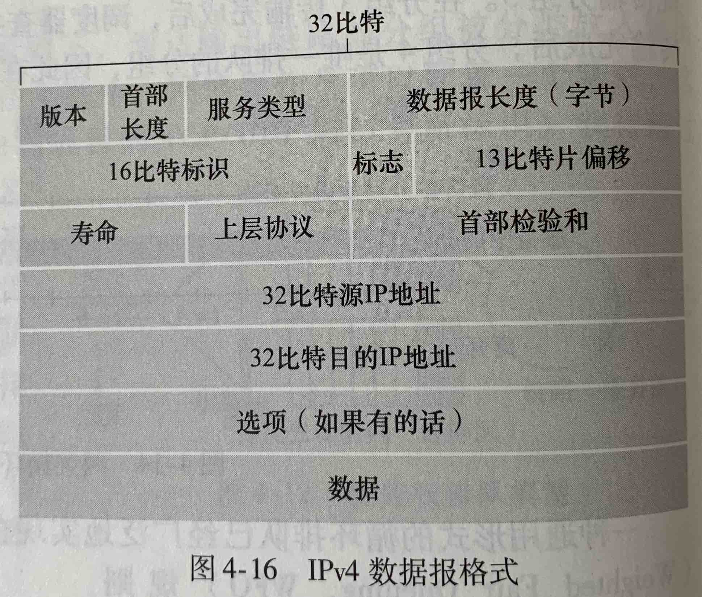
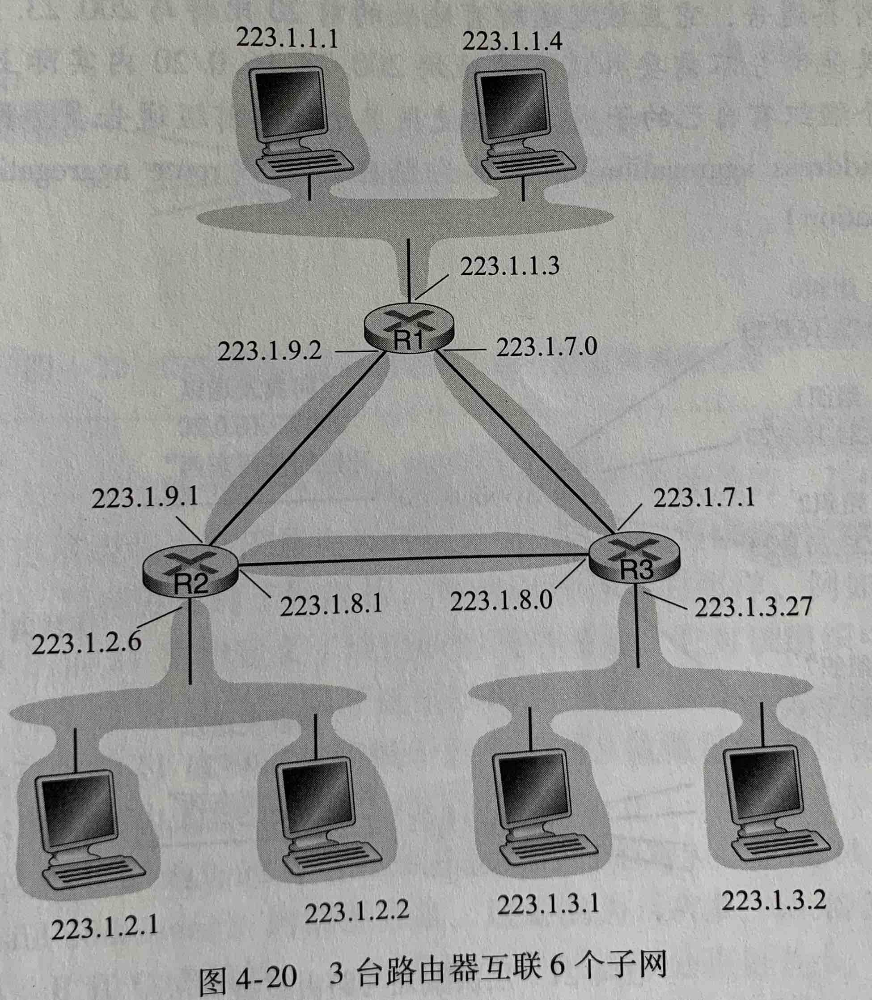

# 第四章 网络层：数据平面

(一部分笔记写在了公司的电脑上，忘记同步到 github 上了)

## IP 协议

上图是一个网络层的 IPv4 数据报的结构，其中的各个字段如下

- 版本号，4 个比特。表示这个数据报的协议版本，上图是 IPv4 的数据报格式，IPv6 的数据报有不同的格式
- 首部长度，4 个比特。以字节为单位表示数据报的首部长度。大多是数据报不包含选项部分，因此首部长度都是 20 字节
- 服务类型，12 比特。服务类型让让不同类型的数据报能够相互区分（如区分实时数据报和非实时数据报）
- 数据报长度，16 比特。数据报的首部和数据长度，理论上数据报最大长度是 65535 字节，但是很少有超过 1500 字节的数据报
- 标识（16 比特）、标志（3 比特）、片偏移（13 比特）。这三个字段与 IP 分片有关
- 寿命，Time-To-Live TTL，8 比特。用于确保数据报不会永远在网络中存在，没经过一个路由器，寿命就会减 1，直到 0 数据报就会被丢弃
- 上层协议， 8 比特。值是 6 表示数据报要交给 TCP，值是 17 表示数据报需要交给 UDP
- 首部检验和。每个路由器都需要计算首部检验和，因为数据报的 TTL 在传输中会变化。路由器只计算首部检验和，而 TCP 会计算整个数据报的检验和
- 选项：选项部分很少被使用，而且在 IPv6 中已经被去除

### 数据分片

数据报在链路中传输，所经过的每条链路可能使用了不同的链路协议，每种链路协议的 **最大传送单元(Maximun Transmission Unit, MTU)** 可能是不同的，因此路由器可能在当数据报比链路 MTU 大时把数据报切割成多个小数据报，每个小数据报就是一个 **片(Fragment)**

数据报被切割后，组装数据报的工作放在了接收端系统，这是为了保持路由器和网络设计的简单性

## IPv4 编址

一个 IPv4 地址由 32 比特组成，通常每 8 个比特分为一组，用 4 个数字表示

下面是一个由多个路由器和主机组成的网络。下面的每个路由器都有一个接口与另外两台主机组成一个 **子网(subnet)**

可以看出，这些子网的左 24 比特的内容都是相同的，这 24 比特就是网络地址。需要注意，网络地址并不一定是 24 比特的，也可以是 21 比特、16 比特、8 比特。下图中最上方的子网地址可以表示为 223.1.1.0/24，24 就是网络地址长度，子网地址也叫做 **子网掩码(network mast)**

当子网长度是 8、16、24 时，这样的子网划分方式叫做 **分类编址(classful addressing)** ，这三类网络被称为 A 类网络、B 类网络和 C 类网络。分类编址的一个缺点是子网的大小要么太小、要么太大。一个 C 类网络只能包含 254 个主机(有两个地址用作特殊用途不能使用)，对于很多组织来说太小了。而一个 B 类地址可以有 65534 个主机，对大多组织来说太大了。因此子网长度不是 8、16、24 时，这样的子网划分方式是 **无类别域间路由选择(Classless Interdomain Routing，CIDR）**

网络地址 255.255.255.255 是广播地址，向这个地址发送的报文会到达同一网络中的所有主机

### DHCP

DHCP 能让一台主机在加入了一个子网后，自动的获取到一个可用的 IP 地址。客户端在加入一个子网后，通过以下步骤获得一个 IP 地址

- DHCP 发现。客户机需要发送网络中的 DHCP 服务器，它使用 UDP 向广播地址 255.255.255.255、端口 67 发送这个报文，源地址是 0.0.0.0
- DHCP 服务器提供。服务器收到了 DHCP 发现报文后，同样向广播地址 255.255.255.255 发出回应，这个回应中包含了发现报文的事务 ID、向客户端推荐的 IP 地址、网络掩码和 IP 地址的租用期
- DHCP 请求。客户机可能会发现网络中存在多个 DHCP 服务器，它从中选择一个，然后发送请求报文
- DHCP ACK。DHCP 服务器收到了请求报文后，发送 DHCP ACK 报文

DHCP 的缺点是，当客户机在子网间移动时，客户机的 IP 地址会发生变化，使得它与远程主机间的 TCP 连接中断

### NAT 协议

NAT 的实现原理是路由器在客户机和服务机之间，修改客户机发送给服务机的报文的源地址和源端口数据，以及修改服务机发送给客户机的报文的目的地址和目的端口数据，被修改的数据保存在路由器内部维护一个端口映射表中